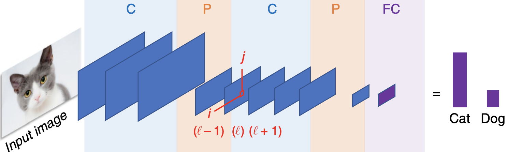

# QCNN

This implementation of a Quantum Convolution Neural Network (QCNN) is based off the work by Cong et al. [1] with the modeling of both convolutional layers and poling layers using IBM's Qiskit and quantum circuits. Example of classical convolutional neural network:

The Quantum Convolution Neural Network (QCNN) directory consists of the following files:

- $\textbf{\textit{QCNN.ipynb}}$: Houses implementation of QCNN using IBM Qiskit [2]. Involves the training and testing of the QCNN with respect to generated data.

- $\textbf{\textit{util.py}}$: File used for function calls in QCNN.ipynb. Main function in file used to generate the data of a $2$ X $4$ pixelated image used for training and testing the network.

- $\textbf{\textit{11\_qcnn\_initial\_point.json}}$: Vector of pretrained weights used in the definition of the neural network classifier prior to training.

# References

[1] Cong I., Chi S., Lukin M. D. 2019. $\textit{Quantum Convolutional Neural Networks}$ https://arxiv.org/pdf/1810.03787.pdf

[2] IBM. 2017. $\textit{The Quantum Convolutional Neural Network}$. https://qiskit-community.github.io/qiskit-machine-learning/tutorials/11_quantum_convolutional_neural_networks.html.

[3] TensorFlow. 2024. $\textit{Quantum Convolutional Neural Network}$. https://www.tensorflow.org/quantum/tutorials/qcnn.