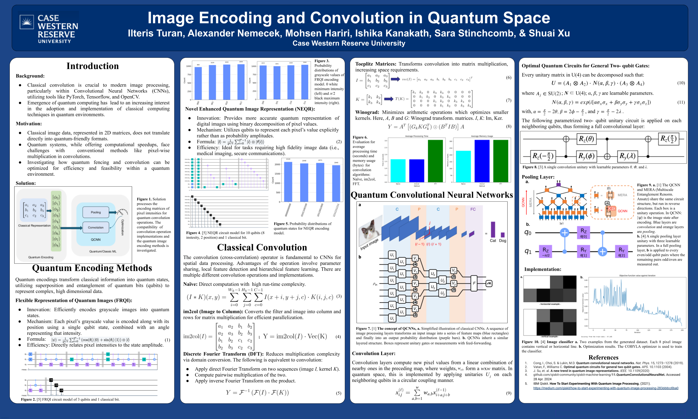

# Quantum-Embeddings-Convolution

This repository is a collection of implementations which combine quantum computing techniques with classical aspects in image processing and convolutional neural networks.

## Convolution Operators
The ```Convolution_Operators``` directory contains different methods of performing convolutions including:
- Naïve Convolution: simple element-wise multiplication approach.
- im2col: rearranges image patches into columns.
- Fast Fourier Transform (FFT): frequency domain approach leveraging the Fourier transform for efficient convolution via element-wise multiplication.

The above methods show different trade-offs in computational efficiency and are a fundamental aspect to the processing of images in classical and quantum settings.

## Embeddings
The ```Embeddings``` directory contains implementations of quantum image encoding techniques for representing images in quantum states.
- Flexible Representation of Quantum Images (FRQI): encodes color and position information into a quantum state.
- Novel Enhanced Quantum Representation (NEQR): representation that stores grayscale and positional data in quantum sequences. 

## Quantum Convolutional Neural Network (QCNN)
The ```QCNN``` directory contains the implementation of a Quantum Convolutional Neural Network (QCNN) and includes:
- ```QCNN.ipynb```: main implementation using IBM's Qiskit framework with training and testing on quantum data.
- ```util.py```: utility functions for data generation and preprocessing.
- ```11_qcnn_initial_point.json```: pretrained weights for initializing the QCNN.

## Poster
